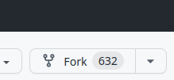

# 使用版本控制进行编码

[版本控制](https://en.wikipedia.org/wiki/Version_control) 允许您跟踪代码的更改。您可以保存进度的“快照”，这意味着您可以轻松回滚撤销操作。版本控制还允许您轻松地将代码备份到在线 _仓库_ 中，例如 Github。它还允许您与他人协作处理相同的代码，而不会发生冲突或担心是谁更改了什么。

```{sidebar} 强烈建议！
强烈建议您[将游戏文件夹置于版本控制之下](#putting-your-game-dir-under-version-control)。使用 git 也是为 Evennia 本身做出贡献的方式。
```

Evennia 使用最常用的版本控制系统，[Git](https://git-scm.com/)。有关使用 Git 的更多帮助，请参阅 [GitHub 官方文档](https://help.github.com/articles/set-up-git#platform-all)。

## 设置 Git

- **Fedora Linux**

        yum install git-core

- **Debian Linux** _(Ubuntu, Linux Mint 等)_

        apt-get install git

- **Windows**: 推荐使用 [Git for Windows](https://gitforwindows.org/)。
- **Mac**: Mac 平台提供两种安装方法，一种通过 MacPorts，您可以在[这里](https://git-scm.com/book/en/Getting-Started-Installing-Git#Installing-on-Mac)了解，或者您可以使用 [Git OSX Installer](https://sourceforge.net/projects/git-osx-installer/)。

> 您可以在[这里](https://git-scm.com/book/en/Getting-Started-Installing-Git)找到更详细的安装说明。

```{sidebar} Git 用户昵称
如果您将代码公开（或为 Evennia 做出贡献），您的名字将对查看代码提交历史的人可见。因此，如果您不愿意在网上使用真实的全名，可以在这里放一个昵称（或您的 github 账号）。
```

为避免以后出现常见问题，您需要设置几个设置；首先，您需要告诉 Git 您的用户名，然后是您的电子邮件地址，以便在您以后提交代码时能够正确地归功于您。

1. 设置提交时 Git 使用的默认名称：

        git config --global user.name "Your Name Here"

2. 设置提交时 Git 使用的默认电子邮件：

        git config --global user.email "your_email@example.com"

> 如果您想快速入门 Git，这里有一个[不错的 YouTube 演讲](https://www.youtube.com/watch?v=1ffBJ4sVUb4#t=1m58s)。虽然有点长，但它将帮助您理解 GIT 背后的基本思想（这反过来使其使用起来更加直观）。

## 常用 Git 命令

```{sidebar} Git 仓库
这只是您指定为受版本控制的文件夹的一个花哨名称。我们将把您的 `mygame` 游戏文件夹变成这样的仓库。Evennia 代码也在一个（单独的）git 仓库中。
```

Git 可以通过 GUI 控制。但通常使用基本的终端/控制台命令更简单，因为这样可以在出现问题时更清楚地显示。

所有这些操作都需要在 _git 仓库_ 内部完成。

Git 乍一看可能会让人望而生畏。但在使用 git 时，您将 99% 的时间使用相同的 2-3 个命令。而且您可以创建 git _别名_，使它们更容易记住。

### `git init`

这会将您驱动器上的文件夹/目录初始化为“git 仓库”

    git init .

`.` 表示应用于当前目录。如果您在 `mygame` 内，这会将您的游戏目录变成一个 git 仓库。实际上就是这样。您只需执行一次此操作。

### `git add`

    git add <file>

这告诉 Git 开始在版本控制下 _跟踪_ 文件。创建新文件时需要执行此操作。您还可以添加当前目录中的所有文件：

    git add .

或者

    git add *

当前目录中的所有文件现在都由 Git 跟踪。对于您想要跟踪的每个文件，您只需执行一次此操作。

### `git commit`

    git commit -a -m "This is the initial commit"

这会 _提交_ 您的更改。它存储当前时间点所有代码的快照（`-a`），并添加消息 `-m`，以便您知道自己做了什么。稍后，您可以 _检出_ 某个时间点的代码。消息是必需的，如果您编写清晰且描述性的日志消息，您会感谢自己。如果不添加 `-m`，则会打开一个文本编辑器供您编写消息。

`git commit` 是您将始终使用的命令，因此为其创建一个 _git 别名_ 可能很有用：

    git config --global alias.cma 'commit -a -m'

运行此命令后，您可以更简单地提交，如下所示：

    git cma "This is the initial commit"

更容易记住！

### `git status`、`git diff` 和 `git log`

    git status -s

这会简短地（`-s`）显示自上次 `git commit` 以来更改的文件。

    git diff --word-diff

这会显示自上次 `git commit` 以来每个文件中确切的更改。`--word-diff` 选项表示它会标记一行中单词的更改。

    git log

这会显示所有 `commit` 的日志。每个日志将显示是谁进行了更改、提交消息以及唯一的 _hash_（例如 `ba214f12ab12e123...`），该哈希唯一描述该提交。

您可以通过一些选项使 `log` 命令更简洁：

    ls=log --pretty=format:%C(green)%h\ %C(yellow)[%ad]%Cred%d\ %Creset%s%Cblue\ [%an] --decorate --date=relative

这添加了颜色和其他花哨效果（使用 `git help log` 查看它们的含义）。

让我们添加别名：

    git config --global alias.st 'status -s'
    git config --global alias.df 'diff --word-diff'
    git config --global alias.ls 'log --pretty=format:%C(green)%h\ %C(yellow)[%ad]%Cred%d\ %Creset%s%Cblue\ [%an] --decorate --date=relative'

现在您可以使用更短的

    git st    # 简短状态
    git dif   # 带有单词标记的差异
    git ls    # 带有漂亮格式的日志

用于这些有用的功能。

### `git branch`、`checkout` 和 `merge`

Git 允许您使用 _分支_。这些是代码可能采用的独立开发路径，彼此完全独立。稍后，您可以将分支中的代码 _合并_ 回另一个分支。Evennia 的 `main` 和 `develop` 分支就是这种情况的例子。

    git branch -b branchaname

这会创建一个新分支，与您所在的分支完全相同。它还将您移动到该分支。

    git branch -D branchname

删除一个分支。

    git branch

显示所有分支，并标记您当前所在的分支。

    git checkout branchname

这会检出另一个分支。只要您在分支中，所有 `git commit` 都将仅提交代码到该分支。

    git checkout .

这会检出您的 _当前分支_，并具有自上次提交以来丢弃所有更改的效果。这就像撤销自上次保存点以来所做的更改。

    git checkout b2342bc21c124

这会检出由您在 `git log` 中找到的哈希标识的特定 _提交_。这会打开一个“临时分支”，其中代码是您进行此提交时的样子。作为示例，您可以使用它来检查错误是何时引入的。检出现有分支以返回到正常时间线，或使用 `git branch -b newbranch` 将此代码分离到可以继续工作的新分支中。

    git merge branchname

这会 _合并_ `branchname` 中的代码到您当前所在的分支中。这样做可能会导致 _合并冲突_，如果两个分支中的相同代码以不同方式更改。有关更多帮助，请参阅[如何解决 git 中的合并冲突](https://phoenixnap.com/kb/how-to-resolve-merge-conflicts-in-git)。

### `git clone`、`git push` 和 `git pull`

所有这些其他命令都只处理位于您本地仓库文件夹中的代码。这些命令允许您与 _远程_ 仓库交换代码——通常是在线的（例如在 github 上）。

> 如何实际设置远程仓库将在[下一节](#pushing-your-code-online)中描述。

    git clone repository/path

这会将远程仓库复制到您当前的位置。如果您使用 [Git 安装说明](../Setup/Installation-Git.md) 安装 Evennia，这就是您用来获取 Evennia 仓库本地副本的方法。

    git pull

一旦您克隆或以其他方式设置了远程仓库，使用 `git pull` 将重新同步远程和本地内容。如果下载的内容与本地更改冲突，git 将强制您 `git commit` 更改，然后才能继续 `git pull`。

    git push

这会将 _当前分支_ 的本地更改上传到远程仓库中同名的分支。要能够执行此操作，您必须对远程仓库具有写权限。

### 其他 git 命令

还有 _很多_ 其他 git 命令。在线阅读它们：

    git reflog

显示单个 git 操作的哈希。这允许您回到 git 事件历史本身。

    git reset

强制将分支重置为早期提交。这可能会丢弃一些历史记录，所以请小心。

    git grep -n -I -i <query>

快速搜索 git 跟踪的所有文件中的短语/文本。非常有用，可以快速找到事物所在。设置别名 `git gr`，如下所示：

```
git config --global alias.gr 'grep -n -I -i'
```

## 将您的游戏目录置于版本控制之下

这利用了上一节中列出的 git 命令。

```{sidebar} git 别名
如果您为上一节中建议的命令设置了 git 别名，可以改用它们！
```

    cd mygame 
    git init . 
    git add *
    git commit -a -m "Initial commit"

您的游戏目录现在由 git 跟踪。

您会注意到一些文件未被 git 版本控制覆盖，特别是您的秘密设置文件 (`mygame/server/conf/secret_settings.py`) 和您的 sqlite3 数据库文件 `mygame/server/evennia.db3`。这是故意的，由文件 `mygame/.gitignore` 控制。

```{warning}
您应该*永远不要*通过删除 `.gitignore` 中的条目将 sqlite3 数据库文件放入 git 中。GIT 是用于备份代码，而不是数据库。这样做可能会导致混乱，并且很有可能会让您感到困惑。进行一次错误或本地更改后，经过几次提交和还原，您将无法跟踪数据库中的内容。如果要备份 SQlite3 数据库，只需将数据库文件复制到安全位置即可。
```

### 将您的代码推送到线上

到目前为止，您的代码仅位于您的私人计算机上。一个好主意是将其备份到在线。最简单的方法是将其 `git push` 到您在 GitHub 上的远程仓库。因此，您需要一个（免费）Github 帐户。

如果您不希望代码公开可见，Github 还允许您设置一个 _私有_ 仓库，仅对您可见。

在 Github 上创建一个新的空仓库。[Github 在这里解释了如何操作](https://help.github.com/articles/create-a-repo/)。_不要_ 允许它添加 README、许可证等，这只会与我们稍后上传的内容发生冲突。

```{sidebar} Origin
我们将远程仓库标记为“origin”。这是 git 的默认设置，这意味着我们以后不需要显式指定它。
```

确保您在本地游戏目录中（之前已初始化为 git 仓库）。

    git remote add origin <github URL>

这告诉 Git 在 `<github URL>` 处有一个远程仓库。请参阅 github 文档以了解要使用的 URL。使用 `git remote -v` 验证远程是否正常工作。

现在我们推送到远程（标记为“origin”，这是默认设置）：

    git push

根据您设置 github 身份验证的方式，您可能会被要求输入 github 用户名和密码。如果您设置了 SSH 身份验证，此命令将正常工作。

您可以使用 `git push` 上传本地更改，以便远程仓库与本地仓库同步。如果您使用 Github 编辑器在线编辑了文件（或协作者推送了代码），请使用 `git pull` 进行同步。

## 为 Evennia 做贡献

如果您想帮助为 Evennia 做出贡献，您必须通过 _forking_ 来实现——在 Github 上制作 Evennia 仓库的远程副本。因此，您需要一个（免费）Github 帐户。这样做是一个与[将您的游戏目录置于版本控制之下](#putting-your-game-dir-under-version-control)（您也应该这样做！）完全分开的过程。

在 [evennia github 页面](https://github.com/evennia/evennia) 的右上角，点击“Fork”按钮：



这将在您的 github 帐户下创建一个新的在线 fork Evennia。

fork 目前只存在于在线。在终端中，`cd` 到您希望开发的文件夹。此文件夹 _不应该_ 是您的游戏目录，也不应该是您在使用 [Git 安装](../Setup/Installation-Git.md) 时克隆 Evennia 的位置。

从此目录运行以下命令：

    git clone https://github.com/yourusername/evennia.git evennia

这会将您的 fork 下载到您的计算机上。它会在您当前的位置创建一个新文件夹 `evennia/`。如果您使用 [Git 安装](../Setup/Installation-Git.md) 安装了 Evennia，此文件夹的内容将与您在该安装期间克隆的 `evennia` 文件夹相同。不同之处在于，此仓库连接到您的远程 fork，而不是“原始” _上游_ Evennia。

当我们克隆我们的 fork 时，git 自动设置了一个标记为 `origin` 的“远程仓库”指向它。因此，如果我们执行 `git pull` 和 `git push`，我们将推送到我们的 fork。

我们现在要添加一个与原始 Evennia 仓库链接的第二个远程仓库。我们将此远程仓库标记为 `upstream`：

    cd evennia
    git remote add upstream https://github.com/evennia/evennia.git

如果您还想访问 Evennia 的 `develop` 分支（最新的开发），请执行以下操作：

    git fetch upstream develop
    git checkout develop

使用

    git checkout main
    git checkout develop

在分支之间切换。

要从上游 Evennia 拉取最新内容，只需检出您想要的分支并执行

    git pull upstream

```{sidebar} 推送到上游
除非您对上游 Evennia 仓库具有写权限，否则您无法执行 `git push upstream`。因此，您无需担心会意外将自己的代码推送到主公共仓库中。
```

### 修复 Evennia 错误或功能

这应该在您的 Evennia fork 中完成。您应该 _始终_ 在基于您要改进的 Evennia 分支的 _单独 git 分支_ 中执行此操作。

    git checkout main (或 develop)
    git branch -b myfixbranch

现在修复需要修复的内容。遵循 [Evennia 代码风格](./Evennia-Code-Style.md)。您可以正常 `git commit` 提交更改。

上游 Evennia 并未停滞不前，因此您需要确保您的工作与上游更改保持同步。确保首先提交您的 `myfixbranch` 更改，然后

    git checkout main (或 develop)
    git pull upstream 
    git checkout myfixbranch
    git merge main (或 develop)

到目前为止，您的 `myfixbranch` 分支仅存在于您的本地计算机上。没有人可以看到它。

    git push

这将自动在您的 Evennia fork 版本中创建一个匹配的 `myfixbranch` 并推送到它。在 github 上，您将能够在 `branches` 下拉列表中看到它。您可以随意将其推送到远程 `myfixbranch`。

一旦您觉得有东西可以分享，您需要[创建一个拉取请求](https://github.com/evennia/evennia/pulls)（PR）：
这是一个正式请求，要求上游 Evennia 采用并将您的代码拉入主仓库。
1. 点击 `New pull request`
2. 选择 `compare across forks`
3. 从 `head repository` 仓库的下拉列表中选择您的 fork。选择正确的分支进行 `compare`。
4. 在 Evennia 端（左侧），确保选择正确的 `base` 分支：如果要为 `develop` 分支贡献更改，则必须选择 `develop` 作为 `base`。
5. 然后点击 `Create pull request` 并在表单中尽可能多地填写信息。
6. 可选：保存您的 PR 后，您可以进入您的代码（在 github 上）并添加一些逐行注释；这可以通过解释复杂的代码或您做出的决策来帮助审阅者。

现在您只需等待您的代码被审查。预计会收到反馈并被要求进行更改、添加更多文档等。合并 PR 可能需要几次迭代。

```{sidebar} 并非所有 PR 都能合并
虽然大多数 PR 都会被合并，但 Evennia 无法**保证**您的 PR 代码将被视为适合合并到上游 Evennia 中。因此，建议您在花费大量时间编写大型代码之前与社区联系（修复错误始终是一个安全的选择！）
```

## 故障排除

### 获取 403：禁止访问

某些用户在 `git push` 到他们的远程仓库时遇到了此问题。他们没有被要求输入用户名/密码（并且没有设置 ssh 密钥）。

一些用户报告说，解决方法是在主目录下创建一个 `.netrc` 文件，并在其中添加您的 github 凭据：

```bash
machine github.com
login <my_github_username>
password <my_github_password>
```
