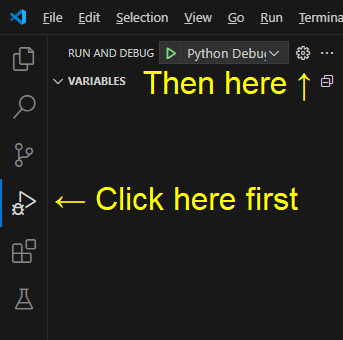
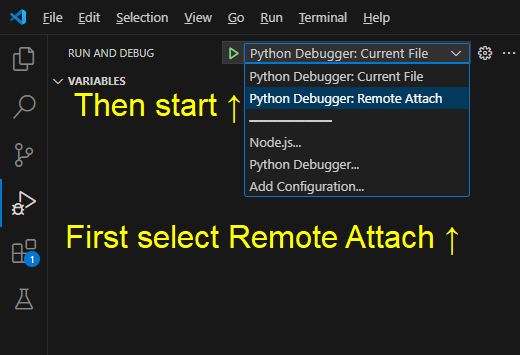

# DebugPy VSCode 调试器集成

由 electroglyph 贡献（2025）

此模块注册了一个游戏内命令 `debugpy`，该命令启动 debugpy 调试器并监听 5678 端口。现在，它仅适用于 Visual Studio Code (VS Code)。

如果您是 JetBrains PyCharm 用户并希望使用此功能，请访问以下链接表达您的需求：
[JetBrains YouTrack](https://youtrack.jetbrains.com/issue/PY-63403/Support-debugpy)

特此感谢 Evennia Discord 的 Moony，感谢你的帮助！

## 安装

此功能需要使用 VS Code 和 debugpy，因此请确保您正在使用 VS Code。

在安装 Evennia 的虚拟环境中运行：

```bash
pip install debugpy
```

### 在 Evennia 中启用命令

在您的 Evennia mygame 文件夹中，打开 `/commands/default_cmdsets.py` 文件

在文件顶部附近添加以下内容：

```python
from evennia.contrib.utils.debugpy import CmdDebugPy
```

在 `CharacterCmdSet.at_cmdset_creation` 方法中，在 `super().at_cmdset_creation()` 下添加：

```python
self.add(CmdDebugPy)
```

### 将“远程附加”选项添加到 VS Code 调试器

启动 VS Code 并像下面这样打开您的 `launch.json`：



将以下内容添加到您的配置中：

```json
{
    "name": "Python Debugger: Remote Attach",
    "justMyCode": false,
    "type": "debugpy",
    "request": "attach",
    "connect": {
        "host": "127.0.0.1",
        "port": 5678
    },
    "pathMappings": [
        {
            "localRoot": "${workspaceFolder}",
            "remoteRoot": "${workspaceFolder}"
        }
    ]
}
```

如果您从与调试相同的机器上运行 Evennia，请将主机设置为 `127.0.0.1`。否则，若要调试远程服务器，请根据需要更改主机（以及可能的 `remoteRoot` 映射）。

添加后，它应类似于以下内容：

```json
{
    "version": "0.2.0",
    "configurations": [
        {
            "name": "Python Debugger: Current File",
            "type": "debugpy",
            "request": "launch",
            "program": "${file}",
            "console": "integratedTerminal"
        },
        {
            "name": "Python Debugger: Remote Attach",
            "justMyCode": false,
            "type": "debugpy",
            "request": "attach",
            "connect": {
                "host": "127.0.0.1",
                "port": 5678
            },
            "pathMappings": [
                {
                    "localRoot": "${workspaceFolder}",
                    "remoteRoot": "${workspaceFolder}"
                }
            ]
        }
    ]
}
```

（请注意花括号之间的逗号）

## 用法

在 VS Code 中设置一个断点，作为调试器停下来的位置。

在 Evennia 中运行 `debugpy` 命令。

您应该看到“正在等待调试器附加...”的提示。

返回 VS Code 附加调试器：



回到 Evennia，您应该看到“调试器已附加。”的消息。

现在触发您设置的断点，您将享受到一个漂亮的图形调试器。


----

<small>此文档页面并非由 `evennia/contrib/utils/debugpy/README.md`自动生成。如想阅读最新文档，请参阅原始README.md文件。</small>
