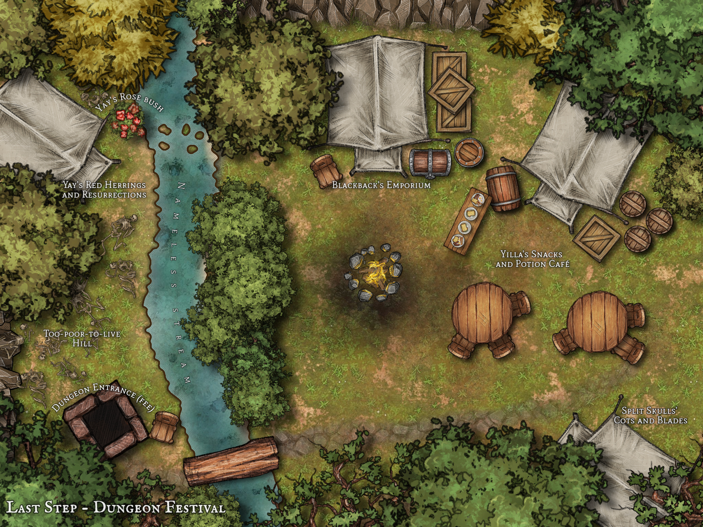

# 规划我们的教程游戏

根据上节课的总体计划，我们现在将确定要为本教程创建的游戏类型。我们将其命名为 _EvAdventure_。记住我们需要控制范围，让我们确定一些参数。

- 我们希望 EvAdventure 是一个我们自己可以玩的有趣的小型游戏，但原则上可以在以后扩展为更大的游戏。
- 我们希望有一个明确的游戏循环和明确的目标。
- 让我们选择一个幻想主题，因为它易于理解。
- 我们将使用一个小型、现有的桌面 RPG 规则集（[Knave](https://www.drivethrurpg.com/product/250888/Knave)，稍后提供更多信息）。
- 我们希望能够创建和定制我们自己的角色。
- 虽然不是以角色扮演为重点，但仍然应该可以社交和合作。
- 我们不希望依赖游戏管理员来解决问题，而是依靠代码来进行技能解决和战斗。
- 我们希望有怪物可以战斗，还有可以交谈的 NPC。所以需要某种 AI。
- 我们希望有某种任务系统和可以购买物品的商人。

## 游戏概念

考虑到这些要点，这里是我们游戏的一个简短介绍：

_最近，附近的村庄发现旧的废弃井中隐藏着一个黑暗的秘密。井底通向一个以前未被发现的不断变化的地牢。没有人知道它为什么在那里或其目的是什么，但当地流言四起。第一个下去的冒险者没有回来。第二个……带回来了一把闪闪发光的财富。_

_现在，抢夺开始了——有一个地牢可以探索，有金币可以赚。流氓、杀手、冒险者，甚至可能有一两个英雄从全国各地赶来挑战井底的未知。_

_当地商人和机会主义者看到了盈利的机会。一个帐篷营地在旧井周围出现，提供食物和饮料、设备、娱乐和传闻，当然是有偿的。这是一个在支付井底入场费之前享受的节日，在阴影中寻找你的命运……_

我们的游戏将由两种主要游戏模式组成——地上和地下。玩家从地上开始，预计会进行“探险”进入黑暗。设计目标是当他们的健康、装备和运气即将耗尽时，被迫返回地面。
- 在地上，在“地牢节日”中，玩家可以补给和治疗，购买物品并完成一小组任务。这是角色可以睡觉和完全恢复健康的唯一地方。他们还需要在这里花费金币来获得经验值和等级。这是玩家社交和角色扮演的地方。地面上没有战斗，除了一个可选的非致命 PvP 地点。
- 地下是神秘的地牢。这是一组程序生成的房间。如果玩家一起下井，他们可以合作，否则他们将无法遇到彼此（因此这作为一个实例）。每个房间通常会提供一些挑战（通常是战斗）。深入探索更危险，但可以获得更大的奖励。虽然理论上房间可以无限延续，但一旦玩家达到足够深度，就应该有一个 Boss 遭遇战。

这是地面营地的概览以供灵感（在 [Inkarnate](https://inkarnate.com/) 的免费版本中快速拼凑而成）。我们将在稍后创建游戏世界时探索如何将其分解为“房间”（位置）。



在本课程的其余部分，我们将回答并围绕之前[游戏规划](./Beginner-Tutorial-Game-Planning.md)课程中提出的具体问题进行推理。

## 管理

### 游戏规则应该由编码系统还是由人类游戏管理员执行？

通常情况下，您期望人类工作人员/GM 做的工作越多，您的代码需要做的工作就越少。为了支持 GM，您需要设计命令以支持 GM 特定的操作以及您希望他们执行的游戏管理类型。您可能需要扩展通信渠道，以便您可以轻松地与私人团体交谈并将游戏团体彼此分开。RPG 规则可以简单到 GM 坐在规则书前并使用骰子滚轮进行可见性。

然而，GM:ing 是一项工作密集型工作，即使是最熟练和最热情的 GM 也无法全天候为国际玩家群体服务。计算机从不需要睡眠，因此即使对于最依赖 GM 的游戏，玩家在没有 GM 的情况下“自助”角色扮演的能力也是一个好主意。

光谱的另一端是完全没有 GM 的游戏；所有游戏玩法都由计算机或玩家之间的互动驱动。这些游戏仍然需要活跃的工作人员，但不需要太多的积极参与。允许玩家在活跃玩家数量较少时与计算机进行单人游戏也可以让他们玩得开心。

**EvAdventure 答案：**

我们希望 EvAdventure 完全不依赖人类 GM。也就是说，如果 GM 想要，他们可以随时介入并为一些玩家运行冒险。

### 您游戏中的员工层级是什么？Evennia 的默认角色是否足够，还是需要其他东西？

默认层级是：

- `Player` - 普通玩家
- `Player Helper` - 可以创建/编辑帮助条目
- `Builder` - 可以使用构建命令
- `Admin` - 可以踢出和禁止帐户
- `Developer` - 完全访问权限，通常也被信任可以访问服务器

还有一个 _superuser_，即您首次设置数据库时创建的游戏“所有者”。该用户超出常规层级，虽然功能强大，但由于绕过所有[锁](../../../Components/Locks.md)，不太适合测试（建议使用 `quell` 或单独的 `Developer` 级别帐户）。

**EvAdventure 答案：**

我们对游戏保持默认的权限结构感到满意。

### 玩家是否可以通过频道和公告板等其他方式发布角色外的内容？

Evennia 的 _Channels_ 默认仅在 _Accounts_ 之间可用。也就是说，供玩家彼此交流。默认情况下，创建了 `public` 频道用于一般讨论。频道会记录到文件中，当您返回游戏时，您可以查看频道的历史记录，以防错过某些内容。

```plaintext
> public Hello world!
[Public] MyName: Hello world!
```

但频道也可以设置为在角色之间工作。这意味着频道将具有游戏内意义：

- 公会成员可以通过心灵感应联系。
- 末日幸存者可以通过对讲机进行交流。
- 可以调入或必须发现的广播电台。

_公告板_ 是一种游戏内论坛，可以公开或私下发布帖子。与频道不同，消息通常是存储的，并按主题分组并带有回复。Evennia 没有默认的公告板系统。

**EvAdventure 答案：**

在 EvAdventure 中，我们将仅使用默认的帐户间频道。我们也不会实现任何公告板；相反，商人 NPC 将充当任务发布者。

## 构建

### 世界将如何构建？

有两种主要方法可以处理此问题：
- 传统上，从游戏内使用构建命令：这意味着构建者在其游戏客户端中创建内容。这具有不需要 Python 技能或服务器访问权限的优点。这通常是一种非常直观的构建方式，因为您在构建时可以在自己的创作中漫步。然而，开发人员（您）必须确保提供足够灵活的构建命令，以便构建者能够创建您想要的游戏内容。
- 外部（通过 batchcmds）：Evennia 的 `batchcmd` 接受一个包含 Evennia 命令的文本文件并按顺序执行它们。这允许在开发过程中快速将构建过程重复应用于新数据库。它还允许构建者使用适当的文本编辑工具，而不是在客户端中逐行编写内容。缺点是要使其更改上线，他们要么需要服务器访问权限，要么需要将其批处理代码发送给游戏管理员，以便他们可以应用更改。或者使用版本控制。
- 外部（使用 batchcode 或自定义代码）：这是“专业游戏开发”方法。这使构建者能够通过使用 Evennia 原语在 Python 中创建内容来获得最大权力。`batchcode` 处理器允许 Evennia 应用和重新应用构建脚本，这些脚本是原始 Python 模块。同样，这需要构建者拥有服务器访问权限或使用版本控制与开发团队的其他成员共享他们的工作。

**EvAdventure 答案：**

对于 EvAdventure，我们将使用批处理脚本构建游戏世界的地上部分。地下世界我们将使用原始代码进行程序化构建。

### 只有特权构建者可以创建东西，还是普通玩家也应该有有限的构建能力？

在某些游戏风格中，玩家可以创建对象，甚至可以对其进行脚本编写。虽然让普通用户能够使用内置命令创建对象既简单又安全，但 Evennia 本身并不支持实际的代码创建（即 _softcode_）。普通的、不受信任的用户永远不应该被允许执行原始的 Python 代码（例如，您可以使用 `py` 命令执行的操作）。您可以[在这里阅读有关 Evennia 对软代码的立场](../../../Coding/Soft-Code.md)。如果您希望用户进行有限的脚本编写，建议通过为他们添加更强大的构建命令来实现。

**EvAdventure 答案：**

对于我们的教程游戏，我们将仅允许特权构建者和管理员修改世界。

## 系统

### 您是基于现有的 RPG 系统还是自己制作？

有很多选项可供选择，您选择的内容取决于您想要的游戏类型。选择一个简短的自由形式规则集可能很诱人，但请记住，计算机没有像人类 GM 那样的直觉或常识来解释规则。相反，如果您选择一个非常“复杂”的游戏系统，具有详细的现实世界模拟，请记住，您需要自己实际编码所有这些异常和表格。

为了实现最快的开发，您需要的是一个 _consolidated_ 解决机制——您可以编写一次代码，然后在许多情况下使用。但您仍然需要足够的规则来帮助计算机解决各种情况（战斗是最常见的需要这种结构的系统）。

**EvAdventure 答案：**

对于本教程，我们将使用 [Knave](https://www.drivethrurpg.com/product/250888/Knave)，这是 Ben Milton 的一个非常轻量的 [OSR](https://en.wikipedia.org/wiki/Old_School_Renaissance) 规则集。它只有几页长，但与老派 D&D 游戏高度兼容。它将所有规则整合在几个对立的 d20 掷骰上，并包含明确的战斗、库存、装备等规则。由于 _Knave_ 是一款桌面 RPG，我们将不得不在某些地方进行一些小的更改，以适应计算机媒介。

_Knave_ 在 Creative Commons Attribution 4.0 许可证下发布，这意味着它可以用于衍生作品（甚至是商业作品）。上面的链接允许您购买 PDF 并支持作者。或者，您可以在[此页面](https://dungeonsandpossums.com/2020/04/some-great-knave-rpg-resources/)上找到非官方的粉丝版本规则。

### 游戏机制是什么？您如何决定某个动作是成功还是失败？

这取决于前一个问题中决定的 RPG 系统。

**EvAdventure 答案：**

_Knave_ 为每个角色提供了一组六个传统属性：力量、智力、敏捷、体质、智慧和魅力。每个属性的值从 +1 到 +10。要找到它的“防御”值，您需要加上 10。

```plaintext
你有力量 +1。你的力量防御是 10 + 1 = 11
```

要进行检查，比如掰腕子挑战，你掷一个二十面骰子（d20）并加上你的属性。你必须掷出比对手在该属性上的防御更高的点数。

```plaintext
我有力量 +1，我的对手有力量 +2。要在掰腕子中击败他们，我必须掷 d20 + 1 并希望得到高于 12 的结果，这是他们的力量防御（10 + 2）。
```

如果你攻击某人，你也要这样做，除了你要掷对方的 `Armor` 防御。如果你掷得更高，你就可以掷出你造成的伤害（取决于你的武器）。
你可以在掷骰时有 _advantage_ 或 _disadvantage_。这意味着掷 2d20 并选择最高或最低值。

在 Knave 中，战斗是回合制的。在我们的实现中，我们也将进行回合制，但我们将同时解决一切。这会改变 _Knave_ 的感觉，但这是计算机可以做的事情，而不是在桌子周围玩时可以做的事情。

我们还需要实现一些表格。例如，如果你失去所有健康，有六分之一的机会会立即死亡。我们将保留这种永久死亡的方面，但让创建新角色并重新加入游戏变得非常容易。

> 在本教程中，我们不会添加利用所有角色属性的机会，使得力量、智力和敏捷等一些属性比其他属性更有用。在完整的游戏中，我们希望扩展以便用户可以利用角色的所有优势。

### 时间流逝在游戏中是否重要——昼夜是否会变化？季节呢？

最常见的是，游戏时间比现实时间快。这样做有几个好处：

- 与单人游戏不同，如果您正在等待某些事情发生，例如 NPC 商店开门，您无法在多人游戏中快进时间。
- 治愈和其他我们知道需要时间的事情将更快地进行，同时仍然是合理的。

主要缺点是对于节奏较慢的角色扮演游戏。当你正在进行一场关于晚餐的深思熟虑的角色扮演场景时，游戏世界报告说已经过去了两天。对于这种游戏，游戏时间比现实时间慢是一种不太常见但可能的解决方案。

然而，不建议让游戏时间与现实时间的速度完全相等。这样做的原因是人们会从世界各地加入您的游戏，他们通常只能在一天中的特定时间玩游戏。随着游戏时间相对于现实时间的漂移，每个人最终都能体验到游戏中的白天和黑夜。

**EvAdventure 答案：**

时间的流逝不会对我们的特定游戏产生影响，因此我们将使用 Evennia 的默认设置，即游戏时间比现实时间快两倍。

### 您想要改变的全球天气，还是天气只是手动设置在角色扮演中？

天气系统是一个很好的示例，说明了一个影响游戏实体（室外房间）子集的全局系统。

**EvAdventure 答案：**

我们不会改变天气，但会添加一些随机消息以在随机间隔回响整个游戏世界，只是为了展示这一原则。

### 您想要编码的世界经济还是只是一个简单的以物易物系统？或者根本没有正式的经济？

这是一个大问题，取决于游戏中发生的虚拟交易的深度和相互关联程度。商店价格可能会因供求关系而上涨和下跌，供应链可能涉及制作和生产。还可以考虑添加货币沉没并操纵游戏内市场以对抗通货膨胀。

[Barter](../../../Contribs/Contrib-Barter.md) contrib 提供了一种完整的界面，用于与其他玩家安全交易。

**EvAdventure 答案：**

我们不会处理这些复杂性。我们将允许玩家从 npc 卖家那里购买，玩家将能够使用正常的 `give` 命令进行交易。

### 您是否有声誉和影响力等概念？

这些对于更注重社交互动的游戏非常有用。

**EvAdventure 答案：**

我们不会将它们包含在本教程中。不过，添加 Barter contrib 很简单。

### 角色会以名字为人所知，还是只通过外貌为人所知？

这是角色扮演游戏中的常见事情。在您自我介绍并让他们“认出”您时，其他人只会将您视为“高个子女人”。与此相关的是更复杂的表情和姿势的概念。

实现这样的系统并不简单，但 [RPsystem](../../../Contribs/Contrib-RPSystem.md) Evennia contrib 提供了一个现成的系统，包含自由表情、通过外貌识别人物等所需的一切。

**EvAdventure 答案：**

我们不会在本教程中使用任何特殊的角色扮演系统。不过，添加 RPSystem contrib 是一个不错的额外扩展！

## 房间

### 简单的房间描述是否足够，还是描述应该能够更改？

更改房间描述以适应昼夜、冬季和夏季实际上很容易做到，但看起来非常令人印象深刻。我们碰巧知道还有一个 contrib 可以帮助实现这一点，所以我们将展示如何包含它。

有一个 [Extended Room](../../../Contribs/Contrib-Extended-Room.md) contrib，它添加了一个房间类型，可以感知一天中的时间以及季节变化。

**EvAdventure 答案：**

在本教程中，我们将坚持使用普通房间，让世界处于永恒的白天。不过，将房间转换为 ExtendedRooms 并不困难。

### 房间是否应该有不同的状态？

可以想象天气使户外房间变得潮湿、寒冷或烧焦。在雨中，弓弦可能会变湿，火球可能会熄灭。在炎热的房间里，角色可能需要喝更多的水，或者如果找不到庇护所，甚至会受到伤害。

**EvAdventure 答案：**

对于地上，我们需要能够在除 PvP 位置之外的所有房间禁用战斗。我们还需要考虑如何自动生成地下的房间。因此，我们可能需要一些状态来控制这一点。

由于地下的每个房间都应该提供某种挑战，我们可能需要一些不同于地上房间的房间类型。

### 可以在房间里隐藏物品吗？一个人可以在房间里隐藏吗？

这与您是否拥有隐藏/潜行机制有关。也许您可以窃听或从隐藏中攻击。

**EvAdventure 答案：**

我们不会建模隐藏和潜行。这将是一场光明正大的面对面冲突的游戏。

## 物品

### 您的物品数量众多吗？您想要大量的战利品列表，还是物品只是角色扮演道具？

这也取决于游戏的类型。在纯自由形式的 RPG 中，大多数物品可能是“虚构的”，只出现在虚构中。如果游戏是更多的编码，您希望物品具有计算机可以测量、跟踪和计算的属性。在许多注重角色扮演的游戏中，您会发现两者的混合体，玩家想象物品用于角色扮演场景，但仅使用“真实”物品来解决冲突。

**EvAdventure 答案：**

我们希望拥有具有属性的物品，例如武器和药水等。即使在我们的示例游戏中，怪物也应该掉落战利品，我们的物品列表也不会很大。

### 每个硬币都是一个单独的物品，还是您只存储银行账户价值？

拥有多个物品的优点是它可以更具沉浸感。缺点是处理单个硬币非常麻烦，尤其是当您必须处理不同的货币时。

**EvAdventure 答案：**

_Knave_ 使用“铜币”作为基础货币，我们也将这样做。Knave 考虑到硬币的重量，一个库存“槽”可以容纳 100 个硬币。因此，我们将实现一个“硬币物品”来表示许多硬币。

### 多个相似的物品是否形成堆叠，在这种情况下如何处理这些堆叠？

如果您在地上放下两个相同的苹果，Evennia 将默认显示为“两个苹果”，但这只是视觉效果——房间里仍然有两个苹果物品。可以想象在您放下苹果时将两者合并为一个对象“X 数量的苹果”。

**EvAdventure 答案：**

我们将保留 Evennia 的默认设置。

### 物品是否有重量或体积（因此您无法携带无限量的物品）？

限制携带重量是一种阻止玩家囤积的方法。它还使玩家更重要地选择他们需要的装备。然而，携带限制很容易让玩家感到恼火，因此需要谨慎对待。

**EvAdventure 答案：**

_Knave_ 将您的库存限制为 `Constitution + 10` 个“槽”，其中大多数物品占用一个槽，而一些大型物品，如盔甲，则占用两个槽。小物品（如戒指）每槽可容纳 2-10 个，您可以在一个槽中容纳 100 个硬币。这是一个重要的游戏机制，可以限制玩家囤积。尤其是因为您需要金币来升级。

### 物品可以被破坏吗？可以修复吗？

物品破损对于游戏经济非常有用；破损的武器增加了战术考虑（如果不是太常见，则会变得恼人），修理东西为制作玩家提供了工作。

**EvAdventure 答案：**

在 _Knave_ 中，如果您在使用物品时犯了严重错误（在 d20 上掷出本地 1），物品将会损坏。这意味着它们会失去一个级别的 `quality`，一旦达到 0，就无法使用。我们不会允许玩家修理，但我们可以允许商人收费修理物品。

### 你可以用椅子或花战斗，还是必须使用一种特殊的“武器”？

传统上，只有“武器”可以用于战斗。在过去，这是一种有用的简化，但使用 Python 类和继承，实际上让游戏中的所有物品都可以在紧要关头用作武器并不需要更多的工作。

**EvAdventure 答案：**

由于 _Knave_ 处理武器列表和可以装备物品的位置，我们将为您可以用来战斗的所有东西创建一个单独的“武器”类。因此，您将无法用椅子战斗（除非我们将其制作成继承武器的椅子）。

### 角色可以制作新物品吗？

制作是多人游戏中的常见功能。在代码中，它通常意味着使用技能检查将来自固定配方的基本成分组合在一起以创建新物品。经典示例是将 _leather straps_、_hilt_、_pommel_ 和 _blade_ 组合成一把新 _sword_。

一个成熟的制作系统可能需要多个级别的制作，包括必须开采矿石或砍伐树木以获取木材。

Evennia 的 [Crafting](../../../Contribs/Contrib-Crafting.md) contrib 为任何游戏添加了一个完整的制作系统。它基于 [Tags](../../../Components/Tags.md)，这意味着几乎任何对象都可以用于制作，甚至可以以意想不到的方式使用。

**EvAdventure 答案：**

在我们的例子中，我们不会添加任何制作，以限制游戏的范围。也许 NPC 可以修理物品——但需要付费？

### Mobs/NPC 是否应该有某种 AI？

作为一项规则，您不应该希望让任何人相信您的 AI 实际上是智能的。您最多只能提供有趣的结果，除非您有一个作为 AI 研究员的副业，否则用户可能不会注意到简单的状态机和您花费大量时间学习如何训练神经网络之间的实际差异。

**EvAdventure 答案：**

对于本教程，我们将展示如何为怪物添加简单的状态机 AI。NPC 将只是商店老板和任务发布者，因此他们不需要任何实际的 AI。

### NPC 和 mobs 是不同的实体吗？它们有何不同？

“mobs”或“mobiles”是指会移动的东西。这通常是您可以与之战斗的怪物，但也可以是城市守卫或面包师去与邻居聊天。过去，它们通常是完全不同的。这些天来，让 NPC 和 mobs 本质上成为同一件事情通常更容易。

**EvAdventure 答案：**

在 EvAdventure 中，怪物和 NPC 的作用非常不同，因此它们将是不同的类，在可能的情况下共享一些代码。

### _是否应该有 NPC 发布任务？如果是这样，您如何跟踪任务状态？

任务是许多经典 RPG 的主打。

**EvAdventure 答案：**

我们将设计一个简单的任务系统，其中包含一些简单的成功条件，例如将正确的物品或物品带回任务发布者。

## 角色

### 玩家是否可以同时拥有多个角色，或者是否允许他们进行多重游戏？

由于 Evennia 区分 `Sessions`（客户端连接到游戏）、`Accounts` 和 `Character`s，它本机支持多重游戏。这由 `MULTISESSION_MODE` 设置控制，其值从 `0`（默认）到 `3`。

- `0`- 每个帐户一个角色，每个帐户一个会话。这意味着如果您从另一个客户端登录到同一个帐户，您将从第一个客户端断开连接。创建新帐户时，将自动创建一个与您的帐户同名的角色。这是默认模式，模仿没有帐户和角色分离的遗留代码库。
- `1` - 每个帐户一个角色，每个帐户多个会话。因此，您可以同时从多个客户端连接，并在所有客户端中看到相同的输出。
- `2` - 每个帐户多个角色，每个角色一个会话。因此，您可以连接到多个客户端并同时看到相同的输出。
- `3` - 每个帐户多个角色，每个角色多个会话。这与模式 2 类似，除了玩家可以从多个客户端控制每个角色，并从每个角色看到相同的输出。

**EvAdventure 答案：**

由于 _Knave_ 的性质，角色很脆弱，可能寿命很短。因此，保留一个稳定的角色没有多大意义。我们将使用模式 0 或 1。

### 角色生成如何工作？

有几种常见的角色生成方式：

- 房间。这是传统方式。每个房间的描述告诉您要使用哪个命令来修改您的角色。完成后，您可以移动到下一个房间。只有在您有其他理由使用房间时才使用此方法，例如有一个训练假人可以测试技能。
- 菜单。Evennia _EvMenu_ 系统允许您编写非常灵活的游戏内菜单，而无需在房间之间移动。您既可以拥有分步菜单（“向导”），也可以允许用户根据需要在步骤之间跳转。这往往更容易让新人理解，因为它不需要使用他们在此之后可能永远不会再使用的自定义命令。
- 问题。构建角色的一种有趣方法是回答一系列问题。这通常是通过顺序菜单实现的。

**EvAdventure 答案：**

Knave 随机化了角色生成的几乎所有方面。我们将使用菜单让玩家添加他们的名字和性别，并根据规则进行少量的属性重新分配。

### 您如何实现不同的“职业”或“种族”？

大多数 RPG 中的职业和种族的工作方式是它们充当静态“模板”，告知您拥有的奖金和特殊能力。大部分内容仅在角色生成或升级时生效。

通常我们只需要在角色上存储他们的 _which_ 职业和 _which_ 种族；实际逻辑可以存在于 Python 代码中，并在需要时进行查找。

**EvAdventure 答案：**

_Knave_ 中没有种族和职业。每个角色都是人类。

### 如果角色可以隐藏在房间里，什么技能将决定他们是否被发现？

隐藏意味着几件事。
- 角色不应出现在房间的描述/角色列表中
- 其他人不应该能够与隐藏的角色互动。如果您可以执行 `attack <name>` 或 `look <name>`，而命名的角色正在隐藏中，那会很奇怪。
- 必须有一种方法让人们从隐藏中走出来，可能还有其他人可以搜索或意外找到这个人（可能基于技能检查）。
- 房间也需要参与其中，可能会有所修饰，以说明在房间中隐藏的难易程度。

**EvAdventure 答案：**

我们不会在 EvAdventure 中包含隐藏机制。

### 技能树是什么样的？角色可以通过杀死敌人、解决任务、角色扮演来获得经验以提高吗？

获得经验值（XP）并提高角色是角色扮演游戏的主打。有很多种方法可以实现这一点：
- 通过击杀获得 XP 非常常见；让怪物“值”一定数量的 XP 很容易，并且很容易知道何时应该获得它。
- 通过任务获得 XP 是一样的——每个任务都“值” XP，完成测试时您会获得它们。
- 从角色扮演中获得 XP 更难定义。不同的游戏尝试了许多不同的方法来做到这一点：
  - 通过在线获得 XP——只要在线就可以获得 XP。这会增加玩家数量，但许多玩家可能只是在潜伏，并没有真正玩游戏。
  - 从角色扮演场景中获得 XP——您根据某种算法分析您的表情的“质量”、发布的频率、表情的长度等来获得 XP。
  - 通过动作获得 XP——您在执行操作时获得 XP，任何操作。也许您的 XP 甚至特定于每个动作，因此当您奔跑时仅获得奔跑的 XP，当您用斧头战斗时获得斧头技能的 XP 等。
  - 从失败中获得 XP——您只有在失败时才获得 XP。
  - 从其他玩家那里获得 XP——其他玩家可以为您出色的角色扮演奖励您 XP。

**EvAdventure 答案：**

我们将使用 _Knave_ 中的替代规则，角色通过花费从冒险中带回的金币来获得 XP。地上商人将允许您花费金币并以 1:1 的比例兑换 XP。每个级别花费 1000 个硬币。每个级别您都有 `1d8 * new level`（至少是您之前拥有的 + 1）HP，并且可以将 3 个不同的能力分数提高 1（最大 +10）。_Knave_ 中没有技能，但提高它们的原理是一样的。

### 玩家角色可以互相攻击（PvP）吗？

决定这一点会影响整个游戏的风格。PvP 使游戏玩法变得激动人心，但当涉及到“公平”时，它会打开一个全新的问题。玩家通常会接受被强大的 NPC 龙杀死。如果他们认为另一个玩家过于强大，他们就不会那么接受。PvP 意味着您必须非常小心地平衡游戏——所有角色不必完全相同，但它们都应该是可以玩的有趣游戏。

PvP 不仅仅意味着战斗。玩家可以通过各种方式竞争，包括在政治游戏中获得影响力或在销售制作商品时获得市场份额。

**EvAdventure 答案：**

我们只允许在一个地方进行 PvP——一个特殊的决斗位置，玩家可以在那里进行训练和声望的模拟战斗，但不会真正被杀死。否则不允许进行 PvP。请注意，如果没有完整的 Barter 系统（只是常规的 `give`），理论上更容易让玩家互相欺骗。

### 失败的惩罚是什么？永久死亡？快速重生？监禁？

这是另一个强烈影响游戏风格和风格的重要决定。

永久死亡意味着一旦你的角色死了，它就消失了，你必须创建一个新角色。

- 它允许真正的英雄主义。如果您真的冒险失去两年的角色来对抗龙，那么您的胜利就是真正的壮举。
- 它限制了老玩家的主导问题。如果长期玩家偶尔会死去，这将为新人打开机会。
- 它降低了通货膨胀，因为死去角色囤积的资源可以被移除。
- 它赋予死刑真正的威慑力。
- 它很现实。

然而，永久死亡带来了一些严重的缺点。

- 许多玩家表示，他们喜欢永久死亡的_想法_，但不喜欢它可能发生在他们身上。
- 如果死亡是永久的，一些玩家拒绝冒任何风险。
- 它可能会让玩家更加不愿扮演冲突驱动的“坏人”。
- 平衡 PvP 变得非常困难。当结果是永久性的时，公平性和避免漏洞变得至关重要。

出于这些原因，采用混合系统非常常见。一些尝试过的变体：

- NPC 不能杀死你，只有其他玩家可以。
- 死亡是永久的，但实际上很难死——你更有可能最终严重受伤/丧失能力。
- 你可以预先支付“保险”以神奇/技术上避免实际死亡。只有当您没有保险时，您才会永远死亡。
- 死亡只是意味着严厉的惩罚，而不是实际的死亡。
- 当你死后，你可以从某种来世中奋战回到生活中。
- 只有当您作为玩家明确允许时，您才会永久死亡。

**EvAdventure 答案：**

在 _Knave_ 中，当您达到 0 HP 时，您会在死亡表上掷骰，1/8 的机会立即死亡（否则您会在随机属性中失去点数）。如果您在死亡时携带足够的硬币，我们将提供一种“保险”让您复活。如果没有，您将永久死亡并且必须创建一个新角色（这很容易且快速，因为它主要是随机的）。

## 结论

通过这些问题，我们对我们想要做的游戏有了更多的感觉。我们可以问自己很多很多其他问题，但如果我们能涵盖这些要点，我们将朝着一个完整的、可玩的游戏迈出一大步！在这些规划课程的最后一节课中，我们将勾勒出这些想法如何映射到 Evennia。
