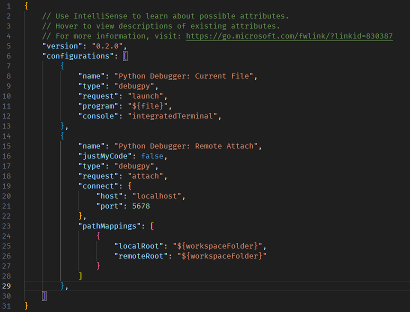

# In-game debugpy command

This registers an in-game command `debugpy` which starts the debugpy debugger and listens on port 5678.
For now this is only available for Visual Studio Code (VS Code).

If you are a JetBrains PyCharm user and would like to use this, make some noise at:
https://youtrack.jetbrains.com/issue/PY-63403/Support-debugpy


Credit for this goes to Moony on the Evennia Discord getting-help channel, thx Moony!

0xDEADFED5 simply tied a pretty bow around it and stuck it here for everybody else.


## Dependencies

This requires VS Code and debugpy, so make sure you're using VS Code.

From the venv where you installed Evennia run:

`pip install debugpy`

## Enable the command in Evennia

In your Evennia mygame folder, open up `\commands\default_cmdsets.py`

add `from evennia.contrib.utils.debugpy.cmd import CmdDebugPy` somewhere near the top.

in CharacterCmdSet.at_cmdset_creation add this under `super().at_cmdset_creation()`:

`self.add(CmdDebugPy)`

For a newly initialized game, the result would look like this at the top of the file:

```python
"""
Command sets

All commands in the game must be grouped in a cmdset.  A given command
can be part of any number of cmdsets and cmdsets can be added/removed
and merged onto entities at runtime.

To create new commands to populate the cmdset, see
`commands/command.py`.

This module wraps the default command sets of Evennia; overloads them
to add/remove commands from the default lineup. You can create your
own cmdsets by inheriting from them or directly from `evennia.CmdSet`.

"""

from evennia import default_cmds
from evennia.contrib.utils.debugpy.cmd import CmdDebugPy

class CharacterCmdSet(default_cmds.CharacterCmdSet):
    """
    The `CharacterCmdSet` contains general in-game commands like `look`,
    `get`, etc available on in-game Character objects. It is merged with
    the `AccountCmdSet` when an Account puppets a Character.
    """

    key = "DefaultCharacter"

    def at_cmdset_creation(self):
        """
        Populates the cmdset
        """
        super().at_cmdset_creation()
        #
        # any commands you add below will overload the default ones.
        #
        self.add(CmdDebugPy)
```

## Add "remote attach" option to VS Code debugger

Start VS Code and open your launch.json like this:


Add this to your configuration:

```
        {
            "name": "Python Debugger: Remote Attach",
            "justMyCode": false,
            "type": "debugpy",
            "request": "attach",
            "connect": {
                "host": "localhost",
                "port": 5678
            },
            "pathMappings": [
                {
                    "localRoot": "${workspaceFolder}",
                    "remoteRoot": "${workspaceFolder}"
                }
            ]
        },
```

Use `localhost` for the host if you are running Evennia from the same machine you'll be debugging from.  Otherwise, if you want to debug a remote server, change host as necessary.

Afterwards it should look something like this:



(notice the comma between the curly braces)

## Use it

Set a breakpoint in VS Code where you want the debugger to stop at.

In Evennia run `debugpy` command.

You should see "Waiting for debugger attach..."

Back in VS Code attach the debugger:


Back in Evennia you should see "Debugger attached."

Now trigger the breakpoint you set and you'll be using a nice graphical debugger.